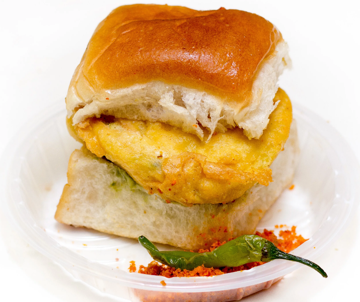

# Vada+Pav Love
 ≠ :hamburger: <br>
A trained model to distinguish if an image has a VadaPav or not !
Thanks to the original work by [@NirajModi](https://github.com/nirajmodi19/14W_Technologies).

## Try it Yourself 

1. Clone the repository ```git clone https://github.com/aakash30jan/vadaPav-love.git```  
2. Install dependencies ```pip install -r ./vadaPav-love/requirements.txt```  
2. From the repository directory, run ```python ./vadaPav-love/predict.py -i <local-or-remote-file-location>```  


## License
<a rel="license" href="http://creativecommons.org/licenses/by/4.0/"></a><br />This work is licensed under a <a rel="license" href="http://creativecommons.org/licenses/by/4.0/">Creative Commons Attribution 4.0 International License</a>.

